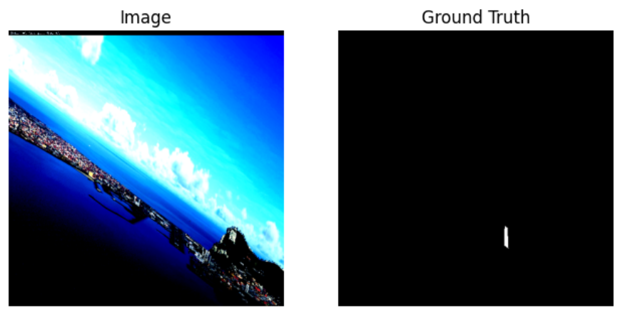
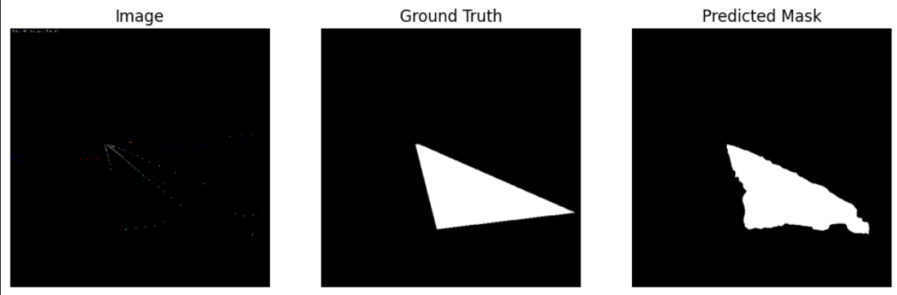
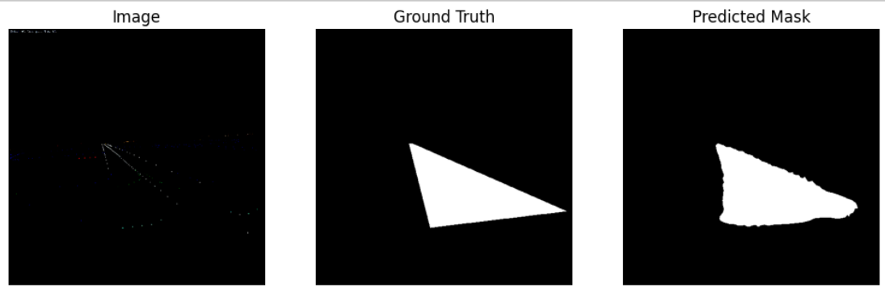
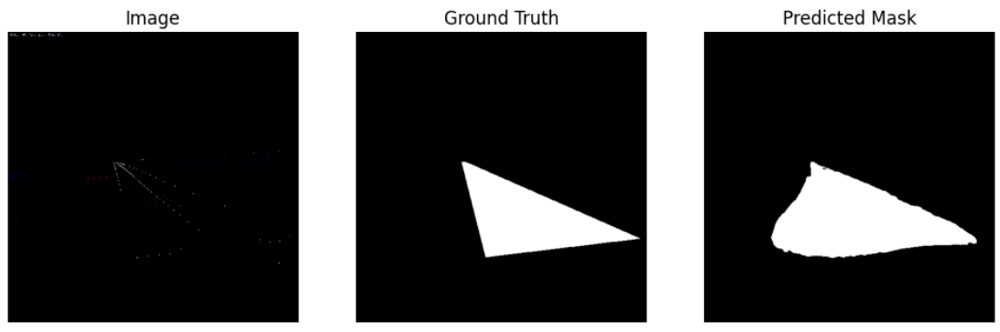
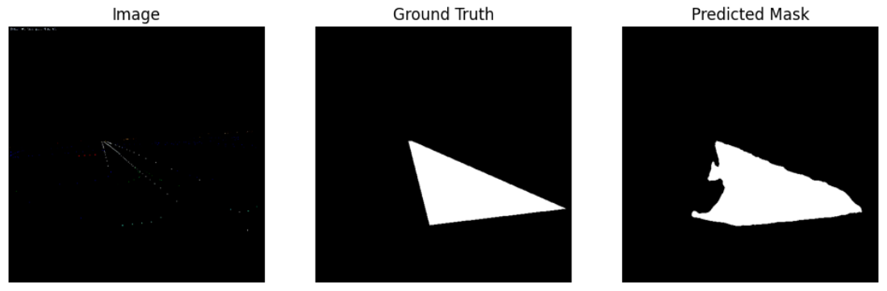
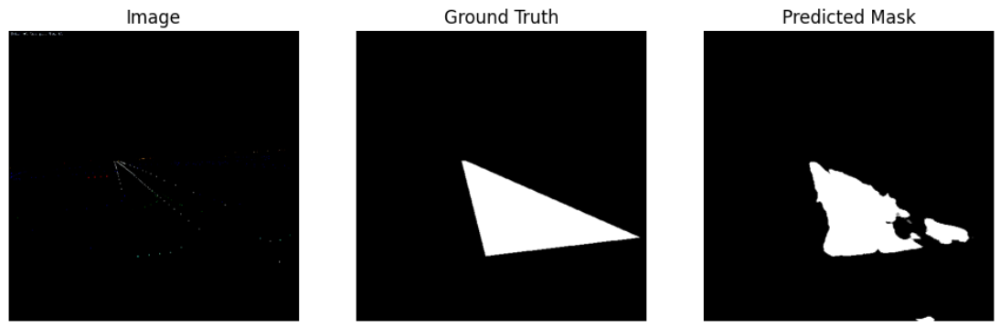
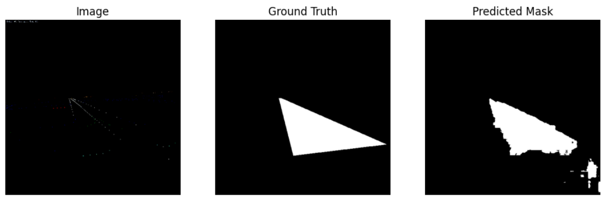

# 🛬 Runway Segmentation for Autonomous Rotorcraft Landing  

This project explores **semantic segmentation of runway areas** from aerial images to enable **automated landing of rotorcraft on moving platforms**. We experiment with a range of models—including both well-established architectures and novel attention-based designs—to evaluate their performance in real-world deployment conditions.

---

## 📦 Dataset

- The dataset consists of RGB images of runways captured from a rotorcraft's perspective.
- The **ground truth** masks are binary segmentation maps with **white regions** representing the **runway**, and **black** indicating background.
- The dataset includes images captured in diverse weather conditions (clear, cloudy) and during both day and night, making the segmentation task more challenging and realistic.
- Sample Image Structure:
  - `Input Image` → Raw RGB aerial view
  - `Ground Truth Mask` → White (runway) on Black background

You can explore the dataset and [learn more here](https://www.kaggle.com/datasets/relufrank/fs2020-runway-dataset). 

---

## 🎯 Objective

To **compare the efficiency and effectiveness** of attention-based segmentation models (like MobileViT and Axial Attention) with traditional models (UNet, DeepLabV3+) for accurate and real-time runway detection.

---

## 🧠 Models Evaluated

| 🎯 **Model**                       | 🔍 **Test Loss** | ⏱ **Inference (ms/img)** | 📊 **Params (Million)** | 📈 **Epochs to Converge** |
| :--------------------------------: | :--------------: | :----------------------: | :----------------------: | :------------------------: |
| UNet (ResNet-34)                  | 0.0115           | 6.08                     | 24.44                    | 33                         |
| DeepLabV3+ (ResNet-18)            | 0.0095           | 4.94                     | 12.33                    | <ins>**21**</ins>                     |
| DeepLabV3+ (MobileNetV2)          | <ins>**0.0086**</ins>       | 6.58                     | 4.38                     | 24                         |
| UNet (EfficientNet-B0)           | 0.0089           | 12.90                    | 6.30                     | 34                         |
| **Axial-UNet** (Experimental)     | 0.0147           | 7.19                     | 20.65                    | 44                         |
| **MobileViT-UNet** (Experimental) | 0.0125           | 7.74                     | 11.89                    | 52                         |
| **MobileViT-UNet Lite** (Experimental)| 0.0183        | <ins>**3.79**</ins>                 | <ins>**2.89**</ins>                 | 61                         |

These evaluations were conducted under identical training conditions:
- Hardware: NVIDIA Tesla P100 GPU
- Batch size: 64
- Image dimensions: 512×512
- Consistent train-test split
- Learning Rate : 1e-3
- Optimizer: Adam
- Loss: Binary Cross-Entropy with Logits (`nn.BCEWithLogitsLoss`)
- Random seed: 33 
---

## 🧪 Key Insights

- **DeepLabV3+ with MobileNetV2** achieves the best **accuracy-efficiency trade-off**.
- **Attention-based models** (Axial, MobileViT) show potential but require **more epochs** and have **higher test losses**—suggesting room for optimization.
- **MobileViT-UNet Lite**, despite being the lightest, performed the low in accuracy but is suitable for **low-latency environments**.

---

## 🖼 Visual Results

Below is a comparison of segmentation outputs for a sample image:

| 🎯 **Model**        | 🔍 **Results**                              |
|:-------------------:|:--------------------------------------------:|
| UNet (ResNet-34)    |                  |
| DeepLabV3+ (R18)    |            |
| DeepLabV3+ (MNV2)   |         |
| UNet (EffNet-B0)    |          |
| Axial-UNet          |                   |
| MobileViT-UNet Lite |          |

---

## 🔗 Project Link

📁 View the complete notebook on **Kaggle**:  
👉 [Runway Platform Detection – Kaggle Notebook](https://www.kaggle.com/code/sohamumbare/runway-platfrom-detection-compressed)

---

## 🚀 Future Work

- Incorporating **temporal consistency** for videos using ConvLSTM/Transformer-based approaches.
- Deployment and benchmarking on **real drone edge devices** (e.g., NVIDIA Jetson Nano, Raspberry Pi).

---

## 📬 Contact

**Soham Umbare**  
IIIT Raichur  
📧 cs23b1068@iiitr.ac.in

---

⭐ _If you find this work interesting, consider giving it a star on Kaggle or GitHub!_

---
🧑‍💻 Happy Experimenting! 🔬

